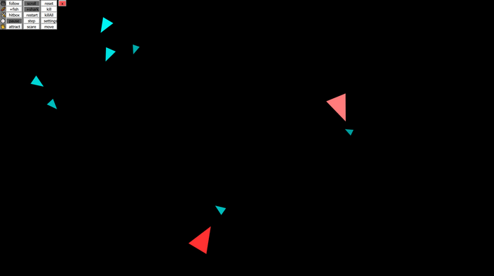

# Flocking sandbox

  

This program is a simulation of fishes using [Boids](https://en.wikipedia.org/wiki/Boids) and [p5.js](https://p5js.org/).
You can spawn a regular fish or a shark, the shark will try to eat the fish and the fish will try to escape.

Use right click to attract the boids and left click to scare them away. You can also use the scroll whell to zoom in our out.

A menu allows you to interact with the camera and the simulation, to open it, just click on the menu icon on the top-left corner.
The sharks will get bigger as they eat the fishes.

You can find it [here](https://rubengres.github.io/FlockingSandbox/index.html)

---

### *Menu description* :

### Camera
**follow :** click on the fish and the camera will keep it centered.  
**scroll :** move your mouse to an edge of the screen to move the camera in that direction.  
**reset :** reset camera and zoom.  

### Life
**+fish :** click anywhere to spawn a fish.  
**+shark :** click anywhere to spawn a shark.  
**kill :** click on a boid to remove it from the simulation.  

### Debug
**hitbox :** shows hitboxes for each boid.  
**restart :** restart the simulation.  
**killAll :** removes all boids from the simulation.  

### Time
**pause :** pause the simulation  
**step :** advance the simulation by a fraction of a second.  
**settings :** open the setting menu. *not yet implemented*  

### Control
**attract :** click and hold to attract the boids to your cursor. *not yet implemented*  
**scare :** click and hold to scare the boids away from your cursor. *not yet implemented*  
**move :** grab a boid and move it somewhere else.  *not yet implemented*
