<!--
  Being Creative in the Age of AI — deck content.

  HOW TO EDIT
  - Slides are separated by a line containing only three dashes: ---
  - Plain markdown works: # heading, - bullet, **bold**, _italic_, [link](url).
  - `# Heading` at the top of a slide becomes the slide's header.
  - Layout-heavy slides (collages, grids, side-by-side image+text) use small HTML
    blocks; edit the text inside them directly.
  - Per-slide options go at the very top of a slide:
        @class: slide-title      (big centered title slide)
        @class: slide-section    (full-bleed section divider)
  - Speaker notes go in a block (press N during the talk to toggle them):
        :::notes
        ...your notes...
        :::
  - Visuals (#shapeViz, #latentMap, #connViz) are drawn by visuals/*.js — leave the
    matching <svg id="..."> placeholders in place.
-->

@class: slide-title

# Being Creative in the Age of AI

Ruben Gres

Artificial Intelligence Technologies Summer School 2026

---

<h1>Ruben Gres</h1>
<ul style="margin-top:0.8rem;">
<li>GameDev, <strong>Creative Technologist</strong> &amp; <strong>AI Engineer</strong></li>
<li>Building <strong>AI-native game prototypes</strong> @ Supercell AI</li>
<li>Based in <strong>Toulouse, France</strong></li>
</ul>

---

# My Work: ML Research

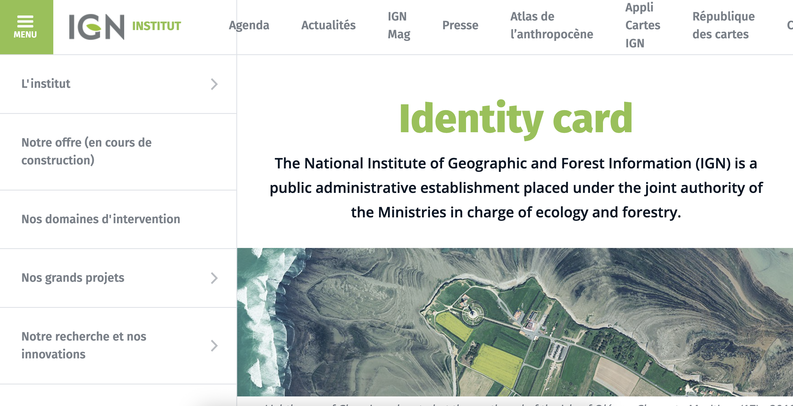

---

# My Work: Art &amp; Installations

<figure style="left:0%;  top:0%;   width:38%; height:50%; transform:rotate(-2deg);">

<figcaption>eat.BITZ: event</figcaption>
</figure>
<figure style="left:36%; top:-3%;  width:30%; height:48%; transform:rotate(2deg);">

<figcaption>eat.BITZ</figcaption>
</figure>
<figure style="left:64%; top:2%;   width:34%; height:50%; transform:rotate(-2.5deg);">

<figcaption>eat.BITZ: oracle cards</figcaption>
</figure>
<figure style="left:2%;  top:50%;  width:44%; height:48%; transform:rotate(1.5deg);">
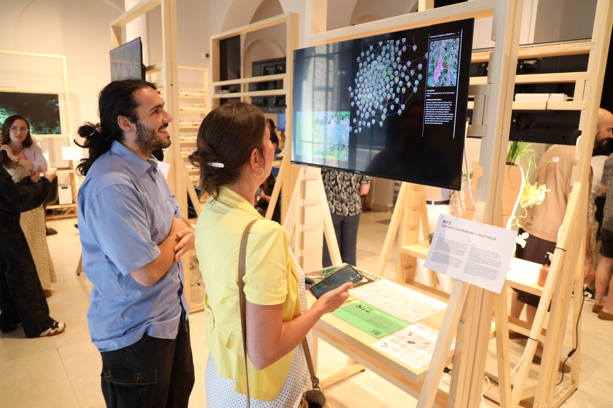
<figcaption></figcaption>
</figure>
<figure style="left:44%; top:50%;  width:54%; height:48%; transform:rotate(-2deg);">

<figcaption>WTFood</figcaption>
</figure>

---

# My Work: Games

<figure style="left:0%;  top:0%;   width:46%; height:50%; transform:rotate(-2deg);">
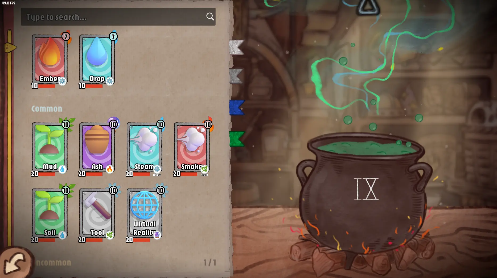
<figcaption>Entropedia</figcaption>
</figure>
<figure style="left:48%; top:-2%;  width:50%; height:50%; transform:rotate(2deg);">

<figcaption></figcaption>
</figure>
<figure style="left:2%;  top:50%;  width:46%; height:48%; transform:rotate(1.5deg);">
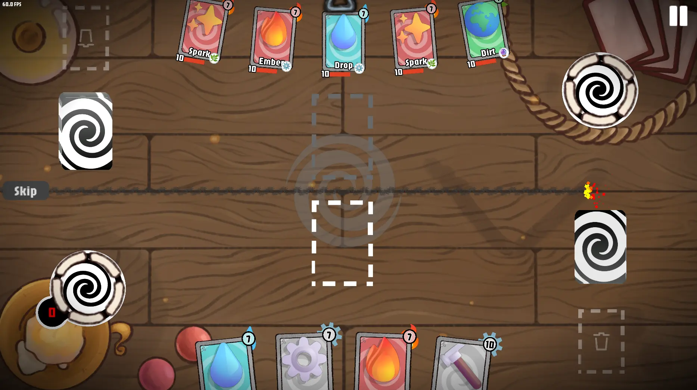
<figcaption>Entropedia: cards</figcaption>
</figure>
<figure style="left:48%; top:50%;  width:50%; height:50%; transform:rotate(-2.5deg);">

<figcaption></figcaption>
</figure>

---

# Where I Work: Supercell

:::notes
Quick context on where I sit. Supercell, Finnish mobile game studio (Clash of Clans, Clash Royale, Brawl Stars, Hay Day). Famously organised as small independent 'cells' with full ownership. I'm in the AI Lab, building AI-native game prototypes, which is the lens for everything that follows.
:::

---

# A Quick Demo

<iframe src="https://www.youtube.com/embed/dd7wrjJPHmY" title="A Quick Demo" frameborder="0" allow="accelerometer; autoplay; clipboard-write; encrypted-media; gyroscope; picture-in-picture; web-share" allowfullscreen style="position:absolute; inset:0; width:100%; height:100%; border-radius:4px;"></iframe>

---

# Disclaimer

:::notes
Set expectations early: this is about how I work with AI, not a tool demo or a take on AI art. Things move fast, some of this may age.
:::

- This talk is focused on **methods over tools**
- Parts of it might still be **outdated in a few months**
- My **opinions are my own**

---

@class: slide-section

# The State of AI

---

# Where We Are Now

:::notes
Background trivia (METR, Measuring AI Ability to Complete Long Tasks, + Time Horizon 1.1, Jan 2026):
• Horizon = the task length, in human time, an AI completes at 50% reliability. It went from ~9 sec for GPT-3-era agents (2020), to ~30 sec (2022), to ~14.5 hours for Claude Opus 4.6 (Feb 2026).
• It ACCELERATED: a ~7-month doubling across 2019–2025, but only ~4 months (≈129 days) since 2023. That speed-up alone pulls the month-long-task milestone ~2.5 years earlier; extrapolation lands month-long tasks (at 50%) somewhere 2027–2031.
• What kind of tasks: ~230 of them, mostly software / ML / cybersecurity, ranging from under 30 sec to 8+ hours, drawn from short software tasks, HCAST, RE-Bench and SWE-Bench Verified. Task length predicts success strongly (R² ≈ 0.83).
• 50% is a coin flip: the 80%-reliability horizon is several times shorter, reliability falls off steeply as tasks get longer.
• Caveat: these are clean, well-specified benchmark tasks; real work is messier. METR calls external validity their biggest source of uncertainty, though the trend held even on messiness-filtered subsets.
:::

<ul class="text" style="flex:0 0 34%;">
<li><strong>Task horizon</strong>: longest job AI finishes solo at <strong>50% reliability</strong></li>
<li>~9 sec (2020) → <strong>14.5 hrs</strong> (2026)</li>
<li>Doubling <strong>~7 months</strong>, and accelerating to <strong>~4</strong> since 2023</li>
<li>Month-long tasks extrapolate to <strong>2027–2031</strong></li>
</ul>
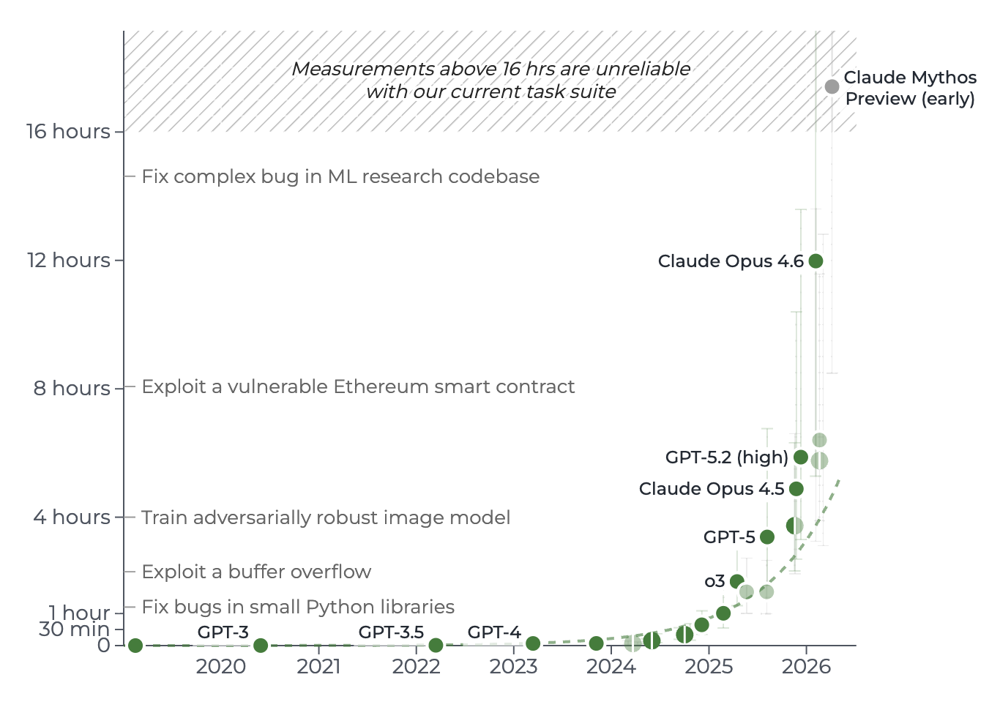

---

# The Jagged Frontier of AI Capabilities

:::notes
AI ability isn't uniform, it's a jagged frontier. Plot every task by difficulty (dashed line = tasks of equal human difficulty) against what AI can actually do (blue = AI abilities). Three regimes emerge: where AI ability sits above the line, the task is INSIDE the frontier, automate it. Where it sits below, the task is OUTSIDE the frontier, still human work. Where the two meet, you're ON the frontier, that's the co-pilot zone, human + AI together. The key move is knowing which task is which.

Examples (game-prototyping lens):
• INSIDE, just automate it: boilerplate and glue code, asset and variation generation, summarising papers, placeholder art, test data, mechanical refactors.
• ON the frontier, co-pilot it: prototyping a new mechanic, drafting a design doc, debugging a gnarly bug, iterating art direction, scaffolding a tool, you steering each step.
• OUTSIDE, still human: deciding what's actually fun, taste and art-direction calls, genuinely novel mechanics, reading the player fantasy, holding the core vision.
:::

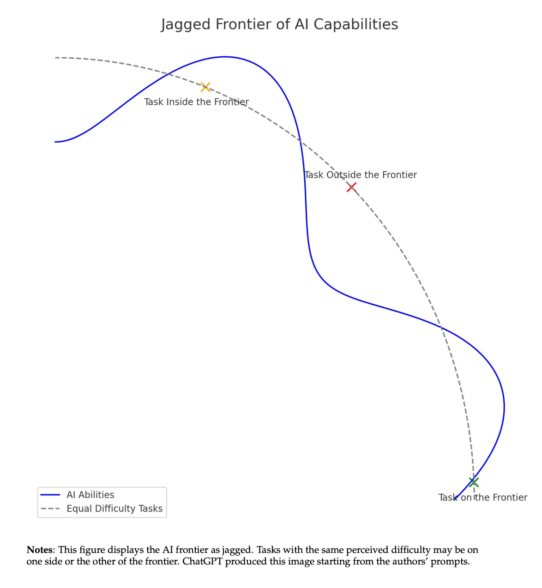

---

# The Shape of AI

:::notes
AI isn't becoming a smarter human, it's an alien shape: a spiky star, not an even circle. Extreme peaks (math, pattern recognition) next to deep valleys (common sense, physical reasoning). Different optimizers: evolution tuned us for survival on ~20 watts; AI is shaped by math, with no such constraints. The jagged frontier may be permanent, raising the ceiling is easy, raising the floor is hard. So most real work is augmentation & human-in-the-loop, not clean replacement.
:::

<svg id="shapeViz" viewBox="0 0 400 400" style="width:60%; max-height:70vh; flex-shrink:0;">
<circle cx="200" cy="200" r="92" fill="#b9d4ee" stroke="#6f9fce" stroke-width="1.5" opacity="0.85"/>
<polygon id="aiStar" points="" fill="#f0b9c4" stroke="#c97f90" stroke-width="1.5" opacity="0.92"/>
<rect x="78" y="378" width="16" height="16" rx="3" fill="#f0b9c4" stroke="#c97f90" stroke-width="1.5"/>
<text x="102" y="391" fill="#888" font-size="15" font-family="sans-serif">AI intelligence</text>
<rect x="232" y="378" width="16" height="16" rx="3" fill="#b9d4ee" stroke="#6f9fce" stroke-width="1.5"/>
<text x="256" y="391" fill="#888" font-size="15" font-family="sans-serif">human intelligence</text>
</svg>

---

@class: slide-section

# What It Can't Do

---

# Competent Mediocrity, at Scale

<figure style="flex:1 1 40%; text-align:center;">
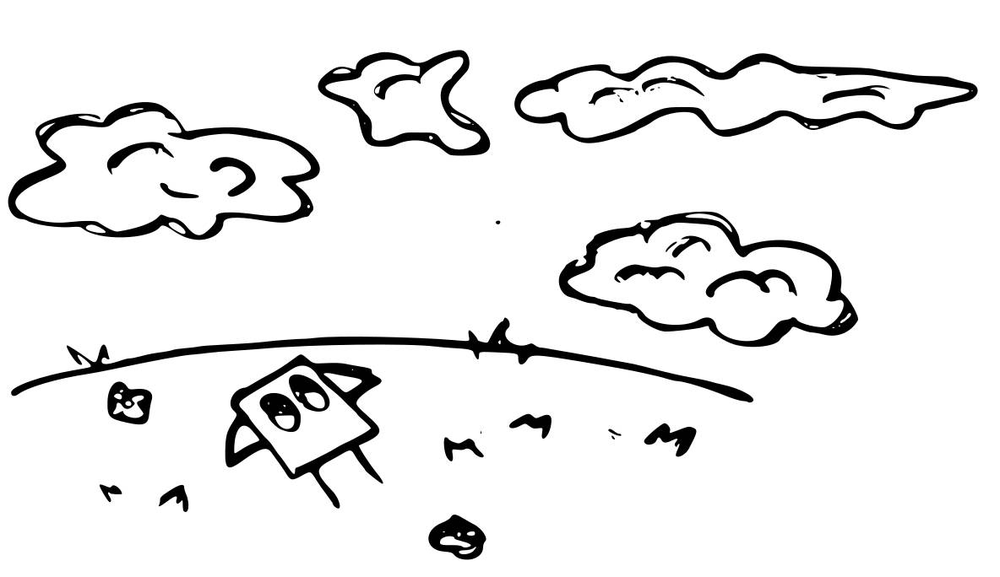
</figure>
<figure style="flex:1 1 40%; text-align:center;">
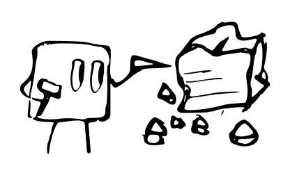
</figure>

<blockquote style="margin-top:2rem; font-size:1.5rem;">
"Art is a circulation of ideas. What makes them appear new is that they're combining differently each time they come back. No two clouds are the same."
<footer style="margin-top:1rem; font-size:1rem; color:#777;">Rick Rubin, <cite>The Creative Act: A Way of Being</cite></footer>
</blockquote>

---

# The Machine Has No Taste

<figure style="flex:1 1 40%; text-align:center;">
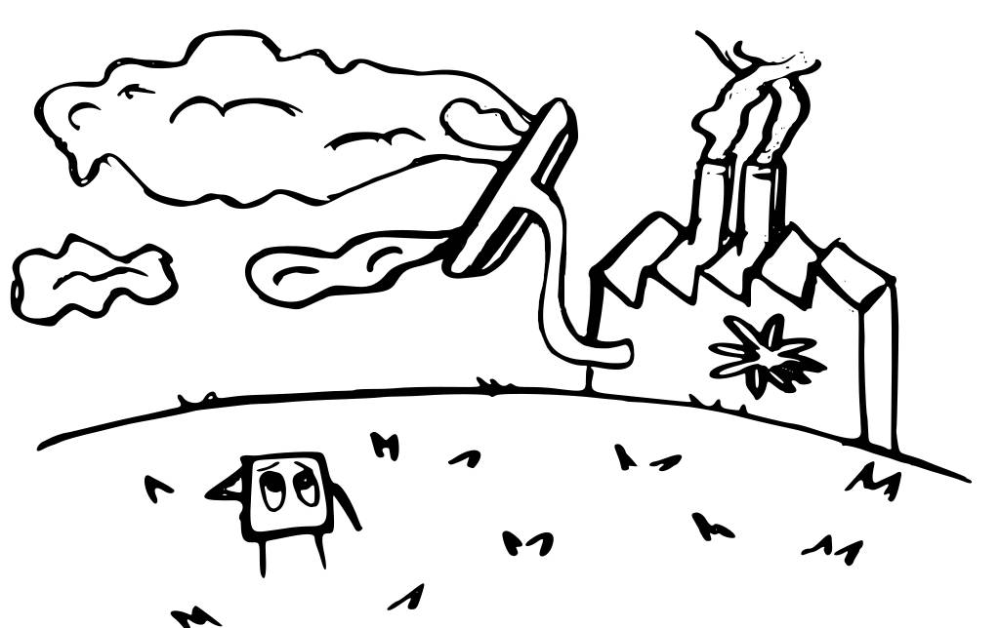
</figure>
<figure style="flex:1 1 40%; text-align:center;">
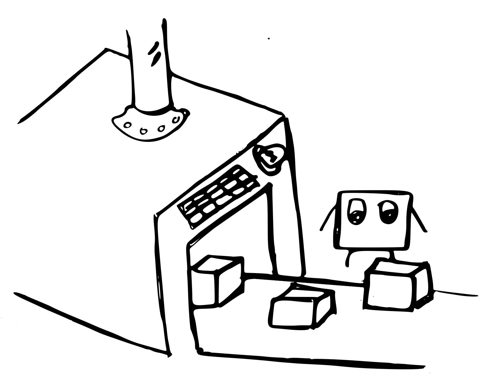
</figure>

<blockquote style="margin-top:2rem; font-size:1.5rem;">
"To say everyone has their own taste is as much as to say there is no taste at all."
<footer style="margin-top:1rem; font-size:1rem; color:#777;">Immanuel Kant</footer>
</blockquote>

---

# It Interpolates, It Doesn't Originate

<ul>
<li>By design, they <strong>interpolate, not originate</strong></li>
<li>Looping text→image→text: any prompt converges to <strong>"visual elevator music"</strong></li>
<li><strong>Merging ideas</strong> works, truly new ones don't</li>
</ul>

<figure style="flex-shrink:0; width:46%; text-align:center;">
<svg id="latentMap" viewBox="0 0 600 460" style="width:100%; max-height:52vh;"></svg>
<figcaption style="font-size:0.78rem; color:#666; margin-top:0.4rem;">how an ML model creates new concepts</figcaption>
</figure>

---

# Slop in the Wild

:::notes
This is what unchecked production looks like in the wild: 'AI slop', the term that entered the dictionary in 2024. All sourced from the Wikipedia 'AI slop' article. Shrimp Jesus and Facebook engagement-bait, fake event ads (Willy's Chocolate Experience, Coca-Cola, McDonald's), political fan-fiction imagery, a fabricated figure that slipped through journal peer review (Frontiers), and viral 'support the veteran' bait. None of it is malicious genius, it's volume without a director. That's the point: production without taste.
:::

<figure style="left:1%;   top:2%;   width:30%; height:40%; transform:rotate(-5deg);   z-index:2;">
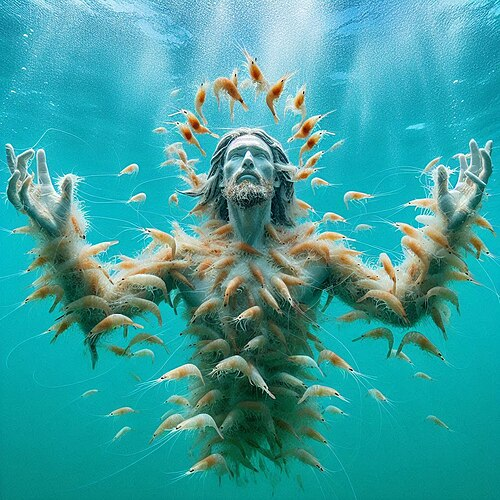
<figcaption>"Shrimp Jesus"</figcaption>
</figure>
<figure style="left:26%;  top:-3%;  width:30%; height:37%; transform:rotate(3deg);    z-index:5;">
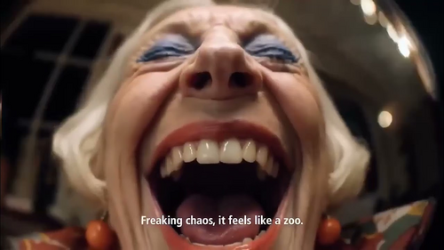
<figcaption>Fake McDonald's ad</figcaption>
</figure>
<figure style="left:50%;  top:1%;   width:26%; height:43%; transform:rotate(-3deg);   z-index:3;">

<figcaption>Political AI imagery</figcaption>
</figure>
<figure style="left:70%;  top:-2%;  width:30%; height:38%; transform:rotate(5deg);    z-index:6;">

<figcaption>Late Night with the Devil</figcaption>
</figure>
<figure style="left:0%;   top:35%;  width:31%; height:38%; transform:rotate(4deg);    z-index:7;">

<figcaption>Coca-Cola: misspelled logo</figcaption>
</figure>
<figure style="left:23%;  top:32%;  width:31%; height:42%; transform:rotate(-4deg);   z-index:4;">

<figcaption>Facebook engagement bait</figcaption>
</figure>
<figure style="left:48%;  top:37%;  width:29%; height:38%; transform:rotate(4deg);    z-index:8;">
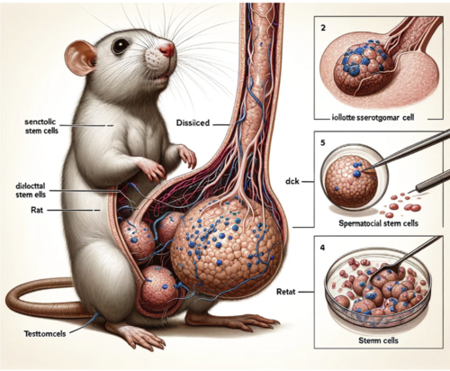
<figcaption>Slipped past peer review</figcaption>
</figure>
<figure style="left:69%;  top:34%;  width:31%; height:41%; transform:rotate(-5deg);   z-index:5;">
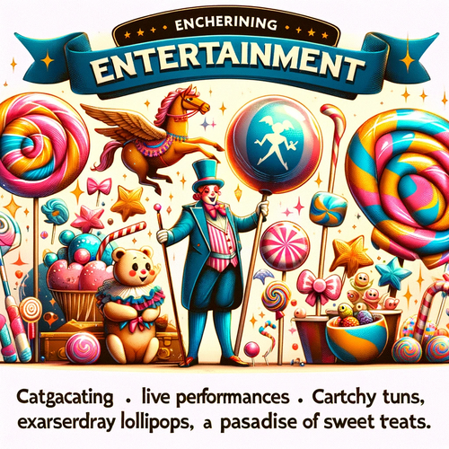
<figcaption>Willy's Chocolate Experience</figcaption>
</figure>
<figure style="left:4%;   top:60%;  width:28%; height:40%; transform:rotate(-3deg);   z-index:9;">

<figcaption>Fan-fiction imagery</figcaption>
</figure>
<figure style="left:32%;  top:62%;  width:31%; height:38%; transform:rotate(4deg);    z-index:6;">

<figcaption>"Support the veteran" bait</figcaption>
</figure>
<figure style="left:61%;  top:60%;  width:31%; height:41%; transform:rotate(-4deg);   z-index:10;">

<figcaption>...and more</figcaption>
</figure>

---

@class: slide-section

# The Post Slop Media Landscape

---

# Cultural Flattening And Drowning In The Noise

<ul>
<li>Anyone can now create anything without much effort</li>
<li><strong>"Spray and Pray"</strong> is then the logical approach</li>
<li>The more content you output, the better the chance of a big hit</li>
<li>People are focusing on <strong>volume over quality</strong></li>
</ul>

<figure style="margin:0;">
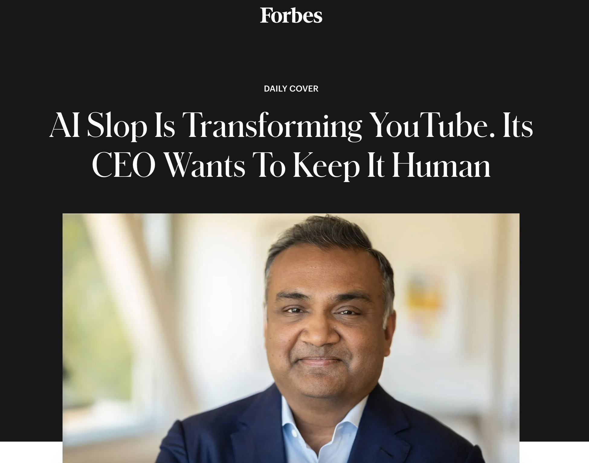
</figure>
<figure style="margin:0;">
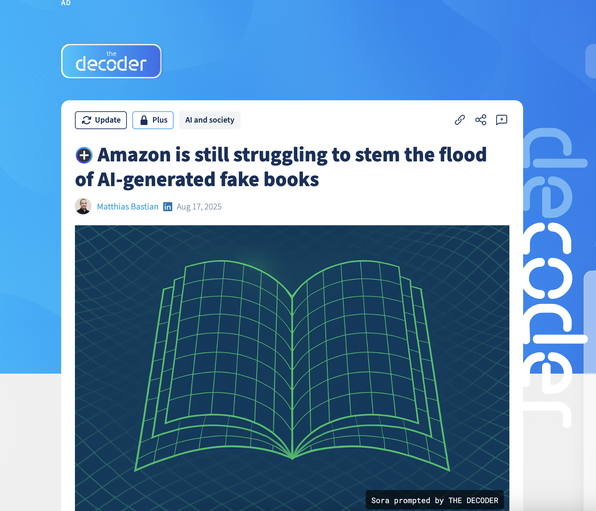
<figcaption style="font-size:0.72rem; color:#666; text-align:center; margin-top:0.5rem; letter-spacing:0.04em;">Amazon's flood of AI-generated fake books (The Decoder, 2025)</figcaption>
</figure>

---

# Big Companies Are Also Trying Things Out

<ul>
<li><strong>Hollywood</strong>: writers' rooms are being replaced by AI</li>
<li><strong>Netflix</strong>: AI used to cut costs, even on big productions (visuals / writing / etc.)</li>
<li><strong>Coca-Cola</strong>: replacing a full marketing team with AI</li>
</ul>

<figure style="margin:0;">
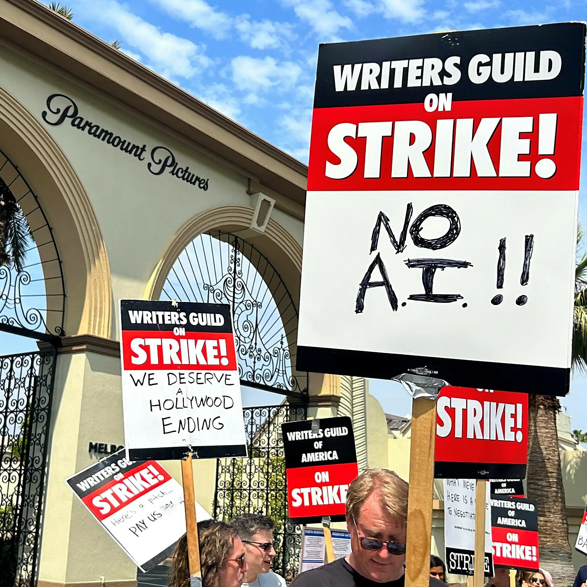
<figcaption style="font-size:0.72rem; color:#666; text-align:center; margin-top:0.5rem; letter-spacing:0.04em;">2023 Writers Guild of America strike</figcaption>
</figure>

---

# For The Return Of Imperfection

<ul>
<li><strong>Polish Era (2010–2020)</strong>: polish is a proof of work and care</li>
<li>Market optimization made everything too perfect and bland</li>
<li>AI accelerates this process, from design to production</li>
<li><strong>Imperfections</strong> are proof of authenticity and value</li>
</ul>

<figure style="margin:0; flex:1;">

<figcaption style="font-size:0.72rem; color:#666; text-align:center; margin-top:0.5rem; letter-spacing:0.04em;">Rembrandt — The Night Watch</figcaption>
</figure>
<figure style="margin:0; flex:1;">
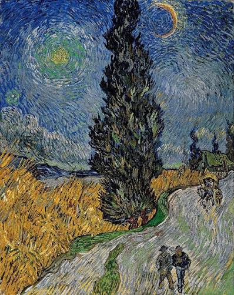
<figcaption style="font-size:0.72rem; color:#666; text-align:center; margin-top:0.5rem; letter-spacing:0.04em;">Van Gogh — Country Road in Provence by Night</figcaption>
</figure>

---

# Gaming: Imperfection as Authenticity

<figure>
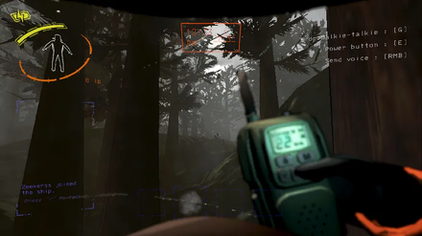
<figcaption>Lethal Company: PS1 aesthetic, biggest cultural moment of 2023–24</figcaption>
</figure>
<figure>

<figcaption>Buckshot Roulette: deliberately ugly, 4M copies sold</figcaption>
</figure>
<figure>
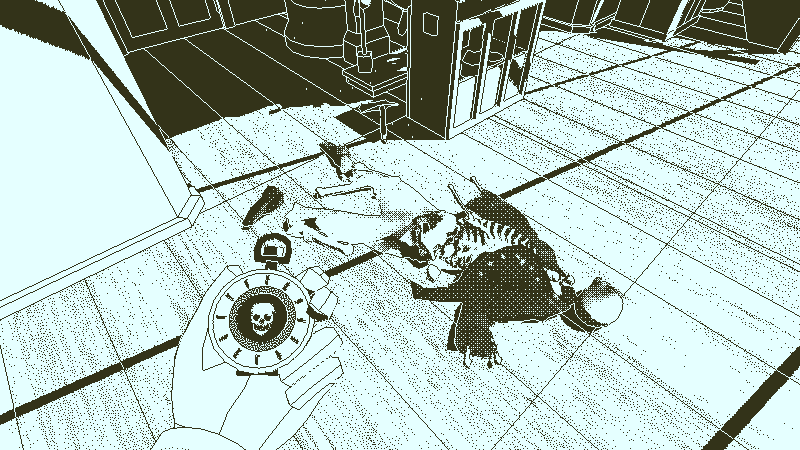
<figcaption>Obra Dinn: 1-bit constraint as full artistic identity</figcaption>
</figure>
<figure>
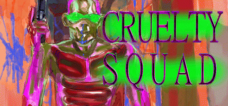
<figcaption>Cruelty Squad: anti-polish as the message</figcaption>
</figure>
<figure>
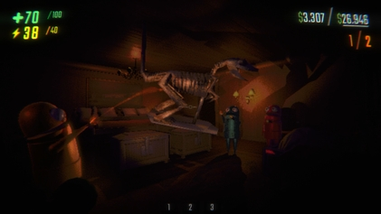
<figcaption>R.E.P.O.: jank physics IS the game, 230k concurrent on launch</figcaption>
</figure>
<figure>
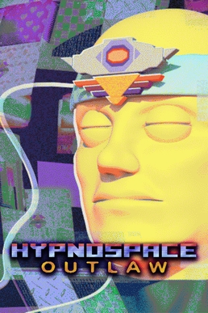
<figcaption>Hypnospace Outlaw: early-web imperfection, hyperspecific to a time and place</figcaption>
</figure>
<figure>
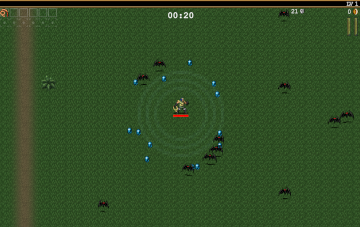
<figcaption>Vampire Survivors: flash-game aesthetic, biggest game of its year</figcaption>
</figure>
<figure>
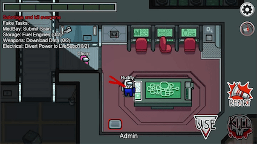
<figcaption>Among Us: visually "bad", maximum cultural spread</figcaption>
</figure>

---

@class: slide-section

# How I Work Using AI

---

# Working with Agents

<ul class="text">
<li><strong>Agents, not chatbots</strong>: file access, execution, HTTP</li>
</ul>

---

# Working with Agents

<ul class="text">
<li>Split vague requests: <strong>plan</strong>, then <strong>execute</strong></li>
</ul>

---

# Working with Agents

<ul class="text">
<li><strong>Off-hours agents</strong>, "warm start" for morning
<ul>
<li>Deep research</li>
<li>Multiple approaches</li>
<li>Issue triage</li>
</ul>
</li>
</ul>

---

# Build Your Own Tools

<ul class="text">
<li><strong>Build your own tools</strong>, focus on what isn't automatable</li>
</ul>

---

# Build Your Own Tools

<ul class="text">
<li><strong>Stop at each error</strong>, correct it once</li>
<li>Keep an <strong>error log (AGENTS.md)</strong></li>
<li>Build <strong>feedback loops</strong> so agents self-verify</li>
</ul>
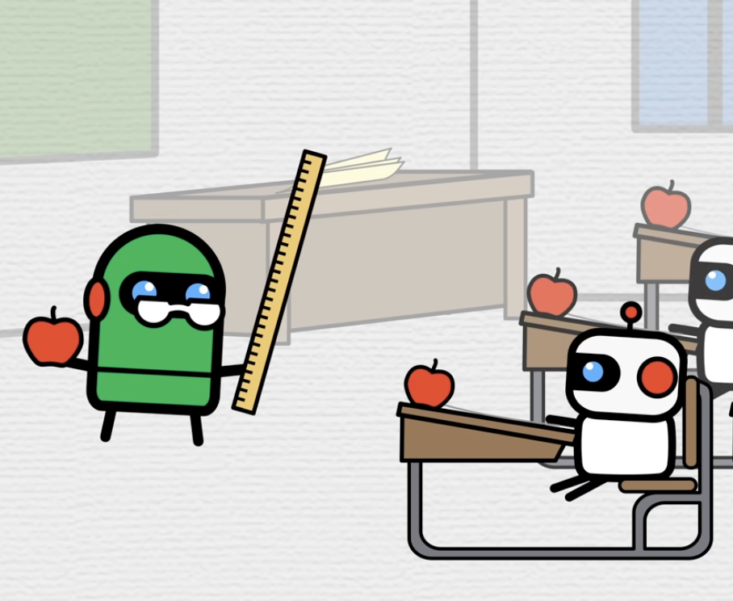

---

# Delegate the Work, Keep the Judgment

<ul class="text">
<li>Delegate only <strong>slam-dunk tasks</strong></li>
<li>Keep your focus for <strong>deep thinking</strong></li>
<li><strong>Limit context switching</strong> as much as possible</li>
</ul>
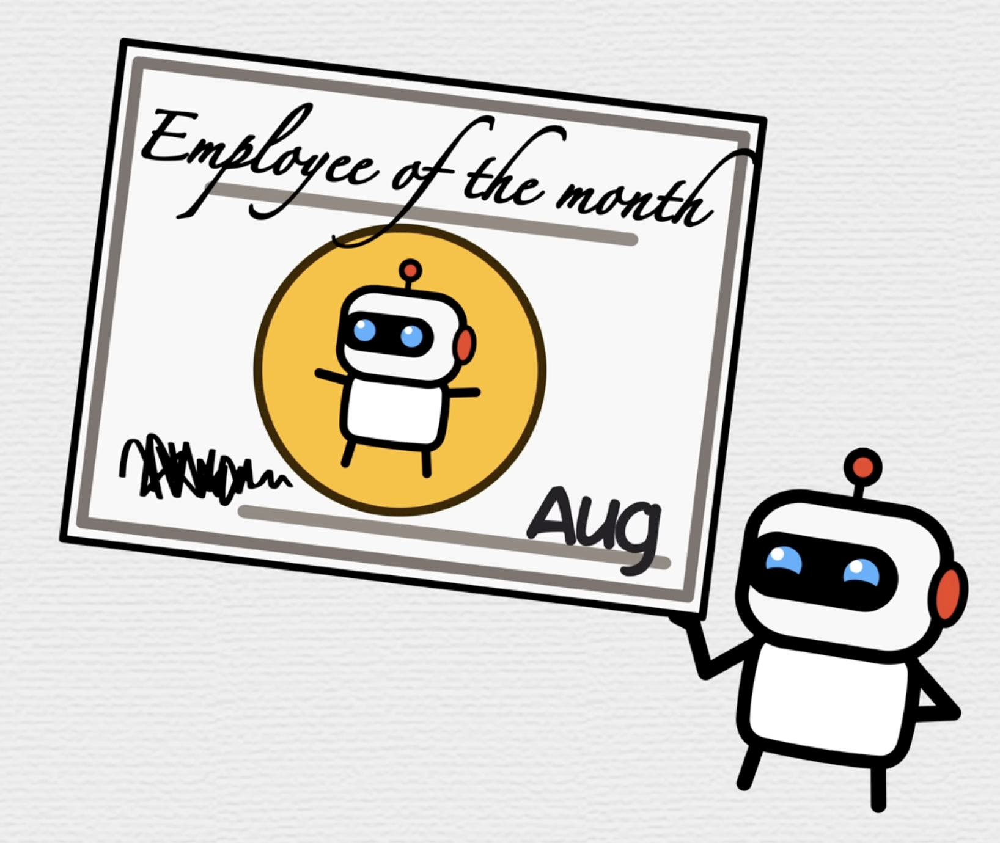

---

@class: slide-section

# Working with Others

---

# Working as a team

<ul class="text" style="flex:0 0 36%;">
<li>Smaller teams work best</li>
<li><strong>Everyone is now a manager</strong></li>
<li>AI helps ideas <strong> spread faster</strong></li>
</ul>
<svg id="connViz" viewBox="0 0 720 340" style="flex:1; max-height:60vh;"></svg>

---

# Our internal organization

<svg id="orgViz" viewBox="0 0 760 700" style="display:block; margin:0 auto; max-height:74vh;"></svg>

---

@class: slide-section

# The Catch

---

# Traps I've Fallen Into

- **Moving too fast**, even if AI is fast we need time to reflect
- **Overscoping**, new features still take time to be tested
- **Relying too much on the AI**, and not knowing how things work
- **Too many agents**, context switching takes time
- **Self collisions**, agents being deadlocked waiting for each other

---

# Future: This Won't Last Forever

<ul class="text">
<li>Token cost dropped <strong>400×</strong> since 2022 ($60 → $0.15/M tokens)</li>
<li>Average AI bills tripled, usage exploded faster than prices fell</li>
<li>Fable 5 (Anthropic) suspended June 2026</li>
<li>Too expensive to work this way for smaller companies</li>
</ul>
<figure style="flex:0 0 42%; margin:0;">
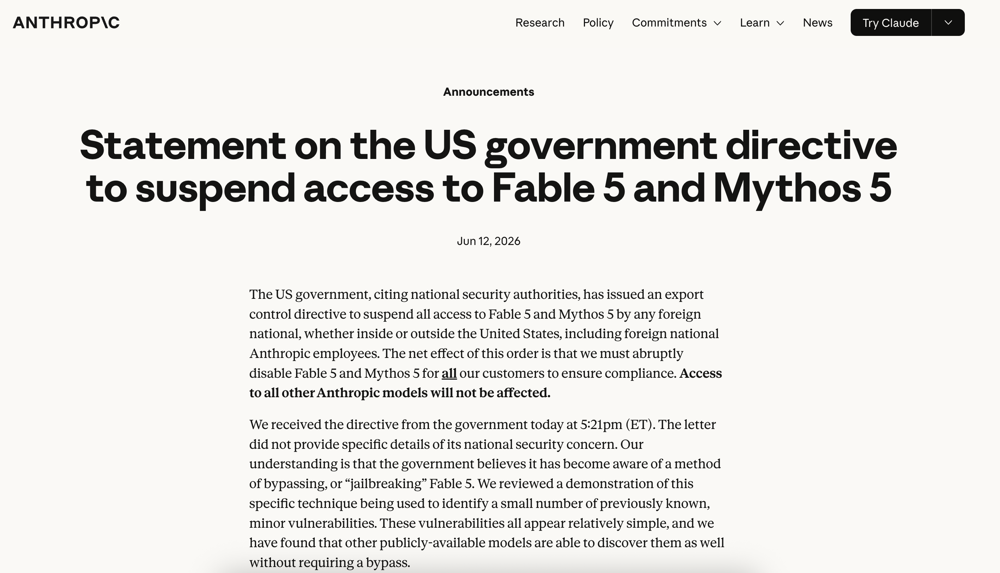
<figcaption style="font-size:0.72rem; color:#666; text-align:center; margin-top:0.5rem; letter-spacing:0.04em;">Anthropic: Fable 5 / Mythos 5 suspension (June 2026)</figcaption>
</figure>

---

# My Bill, One Week

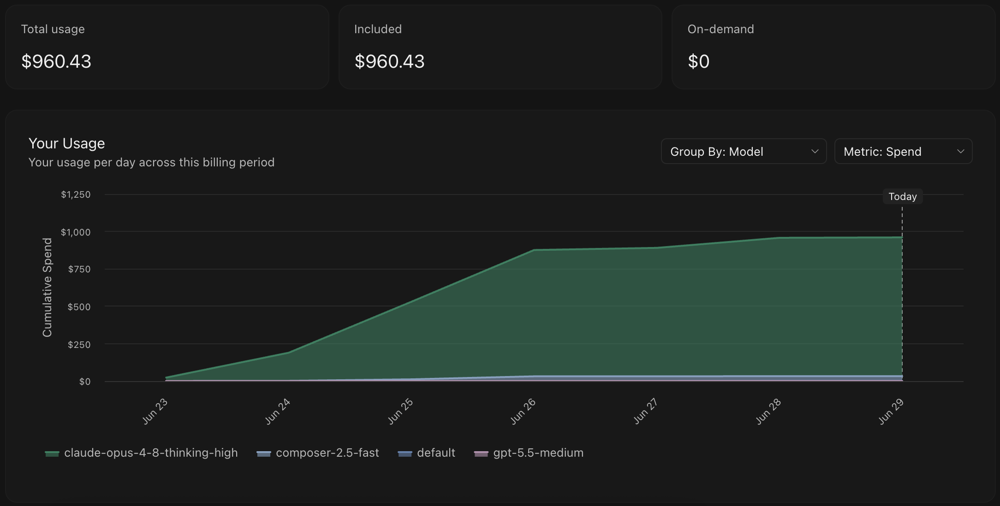

---

# Conclusion

<ul class="text">
<li>No one knows the future of the cultural landscape</li>
<li><strong>Good taste is key</strong>, don't let AI too much freedom</li>
<li>The creative act shifts: from <em>making</em> to <em>noticing</em></li>
<li><strong>Small teams with strong vision</strong></li>
</ul>

---

# Links

<ul class="tight">
<li><a href="https://metr.org/blog/2025-03-19-measuring-ai-ability-to-complete-long-tasks/">METR blog: Measuring AI ability to complete long tasks</a></li>
<li><a href="https://www.thealgorithmicbridge.com/p/the-shape-of-artificial-intelligence">The Shape of Artificial Intelligence: The Algorithmic Bridge</a></li>
<li><a href="https://medium.com/@mohsen.nejad94/jagged-vs-continuous-intelligence-de973cc0ab57">Jagged vs Continuous Intelligence: Medium</a></li>
<li><a href="https://www.futureofbeinghuman.com/p/spiky-surfaces-and-jagged-edges-moving">Spiky Surfaces and Jagged Edges: Future of Being Human</a></li>
<li><a href="https://en.wikipedia.org/wiki/AI_slop">AI slop: Wikipedia</a></li>
<li><a href="https://theconversation.com/ai-induced-cultural-stagnation-is-no-longer-speculation-its-already-happening-272488">AI-induced cultural stagnation: The Conversation</a></li>
<li><a href="https://www.science.org/doi/10.1126/sciadv.adn5290">Generative AI enhances individual creativity but reduces collective diversity: Science Advances</a></li>
<li><a href="https://www.sciencedaily.com/releases/2026/01/260125083356.htm">100,000-person creativity study: ScienceDaily</a></li>
<li><a href="https://www.anthropic.com/news/fable-mythos-access">Fable 5 / Mythos 5 suspension: Anthropic</a></li>
<li><a href="https://www.navyaai.com/reports/ai-cost-report-token-prices-vs-ai-bill">AI token cost: down 99.7%, bills up 3×: NavyaAI</a></li>
<li><a href="https://time.com/article/2026/03/26/ai-slop-is-threatening-musicians-can-tech-companies-stem-the-tide-/">AI slop flooding Spotify: Time</a></li>
<li><a href="https://www.axios.com/2026/03/18/hollywood-ai-amazon-netflix">Hollywood bets on AI: Axios</a></li>
<li><a href="https://www.technologyreview.com/2026/04/21/1135921/ai-malaise-artificial-intelligence-public-sentiment/">AI era of malaise: MIT Technology Review</a></li>
<li><a href="https://www.liminalarc.co/2018/02/lines-of-communication-team-size-applying-brooks-law/">Lines of communication / Brooks' Law on team size: Liminal Arc</a></li>
<li><a href="https://www.lifewithmachines.media/p/brian-eno-on-ai-creativity-and-why">Brian Eno on AI, creativity & "no self-made flower": Life With Machines</a></li>
<li><a href="https://hyphen.art/p/bread-clips-are-the-new-bauhaus">Bread clips are the new Bauhaus: Hyphen</a></li>
</ul>

---

# Let's Chat About It

- What do you want to **keep doing yourself**?
- When everyone can make anything, what becomes **valuable**?
- What kind of creativity are we **losing**?
